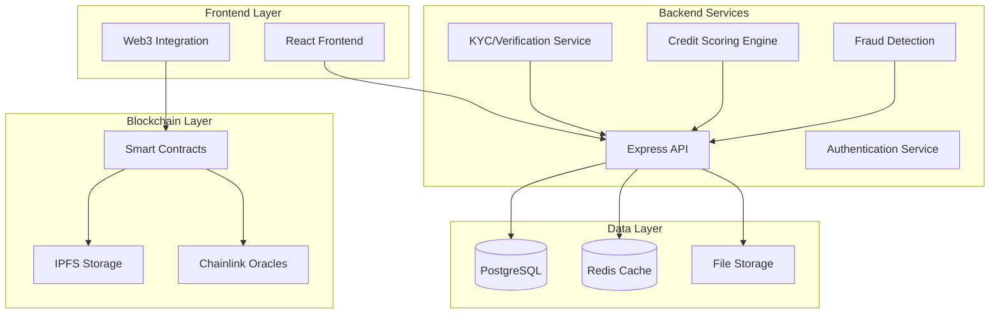

# Fylaro Architecture Documentation

## System Overview

Fylaro is built as a modern, scalable dApp that bridges traditional invoice financing with blockchain technology. The architecture follows microservices principles with clear separation of concerns.

## Component Architecture



## Smart Contract Architecture

### InvoiceToken.sol
- **Purpose**: ERC-721 contract for tokenizing invoices
- **Key Functions**:
  - `tokenizeInvoice()`: Mint new invoice NFT
  - `verifyInvoice()`: Admin verification process
  - `markInvoicePaid()`: Update payment status
  - Credit score tracking and updates

### Marketplace.sol
- **Purpose**: Decentralized marketplace for trading invoice tokens
- **Key Functions**:
  - `listToken()`: Create marketplace listing
  - `buyToken()`: Direct purchase at listing price
  - `placeBid()`: Submit bid for auction-style sales
  - `acceptBid()`: Accept highest bid
- **Features**:
  - Escrow system for secure transactions
  - Platform fee collection
  - Automated bid management

### Settlement.sol
- **Purpose**: Automated payment settlement system
- **Key Functions**:
  - `depositPayment()`: Debtor deposits payment into escrow
  - `releasePayment()`: Release funds to invoice holder
  - `autoReleasePayment()`: Automated release based on conditions
  - `refundPayment()`: Dispute resolution mechanism
- **Features**:
  - Time-based auto-release
  - Multi-party authorization
  - Emergency refund mechanisms

## Backend API Architecture

### Authentication & Authorization
- JWT-based authentication
- Role-based access control (Business, Investor, Admin)
- Wallet signature verification
- Session management

### Core Services

#### Invoice Management
```
POST /api/invoices/upload
GET /api/invoices/my-invoices
GET /api/invoices/:id
PATCH /api/invoices/:id/status
```

#### Marketplace Operations
```
GET /api/marketplace/listings
POST /api/marketplace/bid
GET /api/marketplace/analytics
POST /api/marketplace/purchase
```

#### Payment Tracking
```
GET /api/payments/status/:invoiceId
POST /api/payments/notify
GET /api/payments/history
```

#### User Management
```
POST /api/auth/register
POST /api/auth/login
GET /api/auth/me
PUT /api/auth/profile
```

### Database Schema

#### Users Table
```sql
CREATE TABLE users (
    id SERIAL PRIMARY KEY,
    email VARCHAR(255) UNIQUE NOT NULL,
    password_hash VARCHAR(255) NOT NULL,
    user_type VARCHAR(20) NOT NULL,
    company_name VARCHAR(255),
    first_name VARCHAR(100),
    last_name VARCHAR(100),
    wallet_address VARCHAR(42),
    credit_score INTEGER DEFAULT 500,
    is_verified BOOLEAN DEFAULT FALSE,
    created_at TIMESTAMP DEFAULT NOW(),
    updated_at TIMESTAMP DEFAULT NOW()
);
```

#### Invoices Table
```sql
CREATE TABLE invoices (
    id SERIAL PRIMARY KEY,
    user_id INTEGER REFERENCES users(id),
    token_id INTEGER UNIQUE,
    amount DECIMAL(15,2) NOT NULL,
    due_date DATE NOT NULL,
    debtor_name VARCHAR(255) NOT NULL,
    debtor_email VARCHAR(255) NOT NULL,
    description TEXT,
    industry VARCHAR(50),
    credit_score INTEGER,
    fraud_score DECIMAL(3,2),
    status VARCHAR(20) DEFAULT 'pending_verification',
    file_path VARCHAR(500),
    metadata_uri VARCHAR(500),
    created_at TIMESTAMP DEFAULT NOW(),
    updated_at TIMESTAMP DEFAULT NOW()
);
```

#### Transactions Table
```sql
CREATE TABLE transactions (
    id SERIAL PRIMARY KEY,
    invoice_id INTEGER REFERENCES invoices(id),
    buyer_id INTEGER REFERENCES users(id),
    seller_id INTEGER REFERENCES users(id),
    amount DECIMAL(15,2) NOT NULL,
    transaction_type VARCHAR(20) NOT NULL,
    status VARCHAR(20) DEFAULT 'pending',
    blockchain_hash VARCHAR(66),
    created_at TIMESTAMP DEFAULT NOW()
);
```

## Security Architecture

### Smart Contract Security
- **Access Control**: Role-based permissions using OpenZeppelin
- **Reentrancy Protection**: ReentrancyGuard on all state-changing functions
- **Input Validation**: Comprehensive parameter validation
- **Emergency Mechanisms**: Circuit breakers and emergency stops
- **Upgrade Patterns**: Proxy patterns for contract upgrades

### Backend Security
- **Rate Limiting**: API rate limiting per IP and user
- **Input Sanitization**: Express-validator for all inputs
- **SQL Injection Prevention**: Parameterized queries
- **XSS Protection**: Helmet middleware
- **CORS Configuration**: Strict origin validation
- **File Upload Security**: Type validation and size limits

### Frontend Security
- **Wallet Integration**: Secure Web3 provider connection
- **State Management**: Encrypted local storage for sensitive data
- **API Communication**: HTTPS only with proper headers
- **Content Security Policy**: Strict CSP headers
- **Dependency Management**: Regular security audits

## Performance Architecture

### Caching Strategy
- **Redis**: Session and frequently accessed data
- **Browser Cache**: Static assets with proper headers
- **Database Indexing**: Optimized query performance
- **CDN**: Global content delivery

### Scalability Considerations
- **Horizontal Scaling**: Load balancer ready
- **Database Sharding**: User-based partitioning
- **Microservices**: Service decomposition
- **Container Deployment**: Docker and Kubernetes ready

## Monitoring & Observability

### Logging
- **Structured Logging**: JSON format with Winston
- **Request Tracing**: Unique request IDs
- **Error Tracking**: Centralized error collection
- **Performance Metrics**: Response time monitoring

### Metrics
- **Business Metrics**: Transaction volume, user growth
- **Technical Metrics**: API response times, error rates
- **Blockchain Metrics**: Gas usage, transaction success rates
- **User Metrics**: Engagement, conversion rates

## Deployment Architecture

### Infrastructure
```yaml
Production:
  Frontend: Vercel/Netlify
  Backend: AWS ECS/Google Cloud Run
  Database: AWS RDS PostgreSQL
  Cache: AWS ElastiCache Redis
  Storage: AWS S3
  CDN: CloudFlare

Development:
  Frontend: Local development server
  Backend: Local Express server
  Database: Local PostgreSQL
  Cache: Local Redis
  Blockchain: Local Hardhat network
```

### CI/CD Pipeline
1. **Code Commit**: GitHub repository
2. **Automated Testing**: Jest unit tests
3. **Security Scanning**: Dependency vulnerability checks
4. **Smart Contract Testing**: Hardhat test suite
5. **Build & Deploy**: Automated deployment on merge to main

This architecture provides a robust, secure, and scalable foundation for Fylaro's invoice financing platform, enabling seamless integration between traditional finance and blockchain technology.